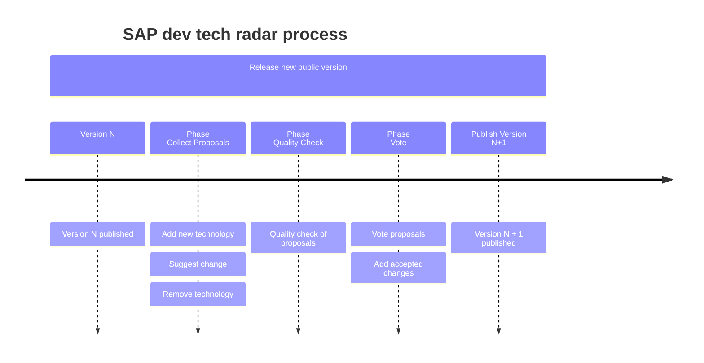
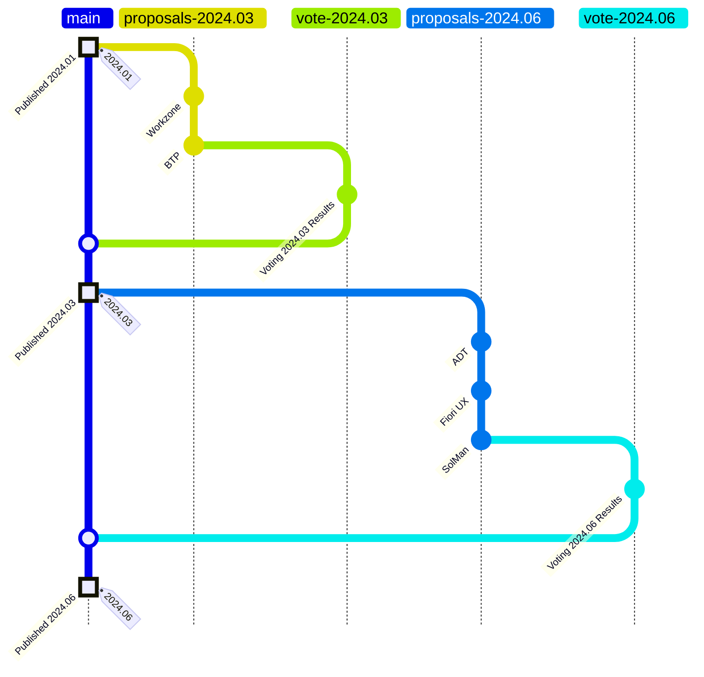

# Publishing process

This document explains how a new version of the SAP development tech radar (SDTR) is authored and published.

The graphic provides the general process, including the involved steps, tasks and timeline.

Everyone can add a technology. While the SDTR is independent from SAP, SAP employees can submit changes, and are invited to do so. The indepence from SAP is ensured by the voting process. SAP employees cannot cast a vote.

## General remarks

### New published version

A new published version is planned to occur at least twice a year, with a max of 4. Each quarter not more than one version must be published.

The version name should reflect this: YEAR.COUNTER. While the year is the 4 digit number of the year, counter should indicate the month number in 2 digits. 2024.01 indicates that the version was published in January 2024. 2024.06 stands for the version published in June 2024. Even with two published version a year, the counter does not indicate the published number in that year. The version number therefore gives clear information on how old the current published SDTR is.

### Propose changes

Changes can be proposed only after a new version was published. Therefore, changes are relative to the latest SDTR version. A new cycle for collecting changes is announced via a git issue.

Each new version starts with a phase where proposals are collected. Changes to the technology are proposed via git. See the CONTRIBUTING documentation on how to propose a change. This happens by providing the needed information to a specific git branch. In case the person submitting cannot do so, the proposal can also be submitted via an issue.

For adding a new technology, the provided tempate must be used. For changing an existing technology (move ring, change information), the currently used definition serves as template.

### Quality check

Submissions are checked for quality. Specific information must be provided for the technology. Only then the change is added to the current backlog.

### Voting proposed changes

All proposals that passed the quality check are analyzed and voted for. The voting is to determine if or if not the change is added as-is to the SDTR. The indepence from SAP is ensured by the voting process. SAP employees cannot cast a vote.

### Publishing

Pusblishing of accepted changes to the SDTR happens by merging the changes to the main branch. A new version is tagged as a release and published on the web page. After this, the new SDTR is automatically active and the new published version.

